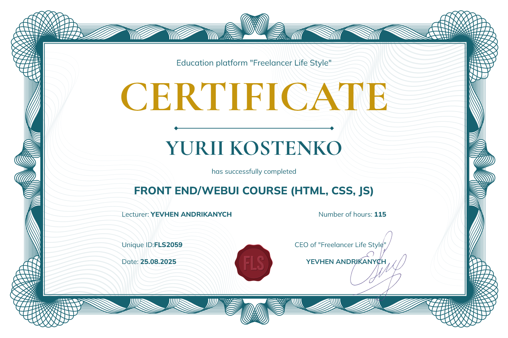

# Front-End Portfolio — Yurii Kostenko

I develop responsive, accessible, and maintainable front-end interfaces using **HTML, SCSS, JavaScript**, and modern layout techniques.

| Project | Demo | Repo |
|---------|------|------|
| Holiday Time | [Live Demo](https://yurikostenko.github.io/portfolio/holiday-time/) | [Code](https://github.com/yurikostenko/portfolio/tree/main/holiday-time) |
| HYDRA | [Live Demo](https://yurikostenko.github.io/portfolio/hydra/dist/) | [Code](https://github.com/yurikostenko/portfolio/tree/main/hydra) |
| Ecobazar | [Live Demo](https://yurikostenko.github.io/portfolio/ecobazar/) | [Code](https://github.com/yurikostenko/portfolio/tree/main/ecobazar) |
| Headphones | [Live Demo](https://yurikostenko.github.io/portfolio/headphones/) | [Code](https://github.com/yurikostenko/portfolio/tree/main/headphones) |

---

### 🧰 Tech Stack

 **HTML5 / BEM methodology**
- **CSS3 / SCSS (preprocessor)**  
- **Flexbox / CSS Grid**
- **Adaptive & Responsive Layout**
- **JavaScript (ES6+)**  
- **Custom sliders, pop-ups, burger menus**
- **Gulp/Webpack build tools**
- **Git & GitHub**
- **Figma to HTML workflow**
- **Cross-browser testing & optimization**

### 📜 Certificate

  
_(сертифікат після проходження курсу HTML/CSS/JS)_

---

### 📫 Contact Me

- [LinkedIn](https://www.linkedin.com/in/%D1%8E%D1%80%D1%96%D0%B9-%D0%BA%D0%BE%D1%81%D1%82%D0%B5%D0%BD%D0%BA%D0%BE-061247309/)
- [Email](mailto:papayy3@gmail.com)

